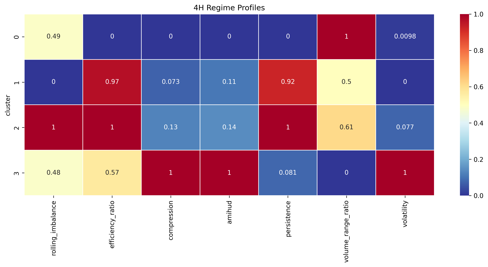
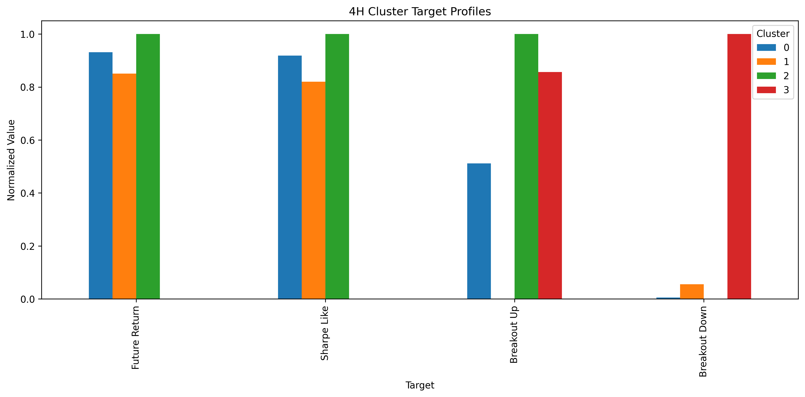
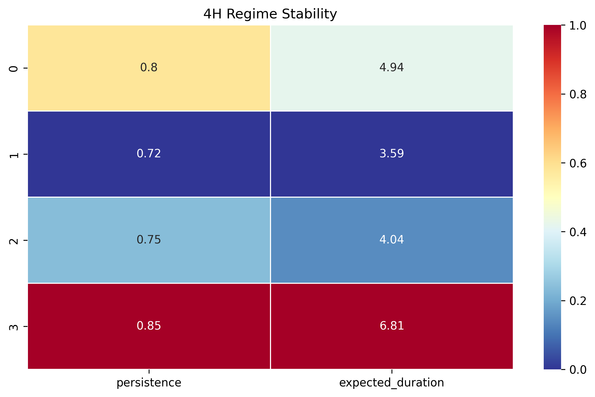
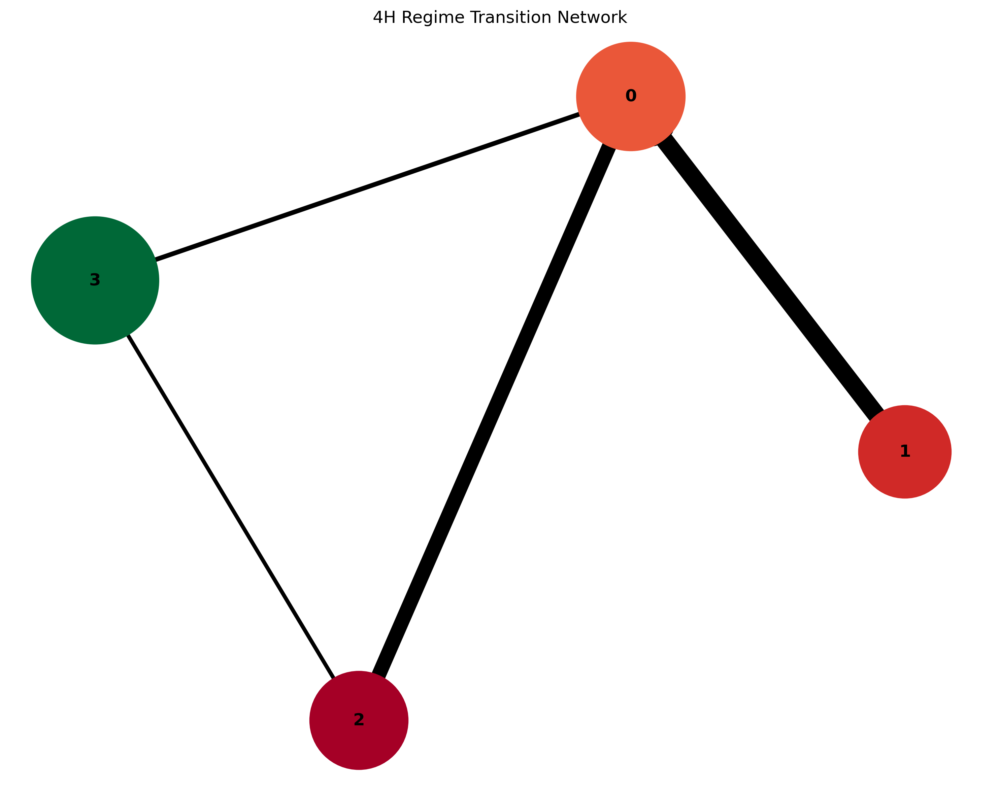
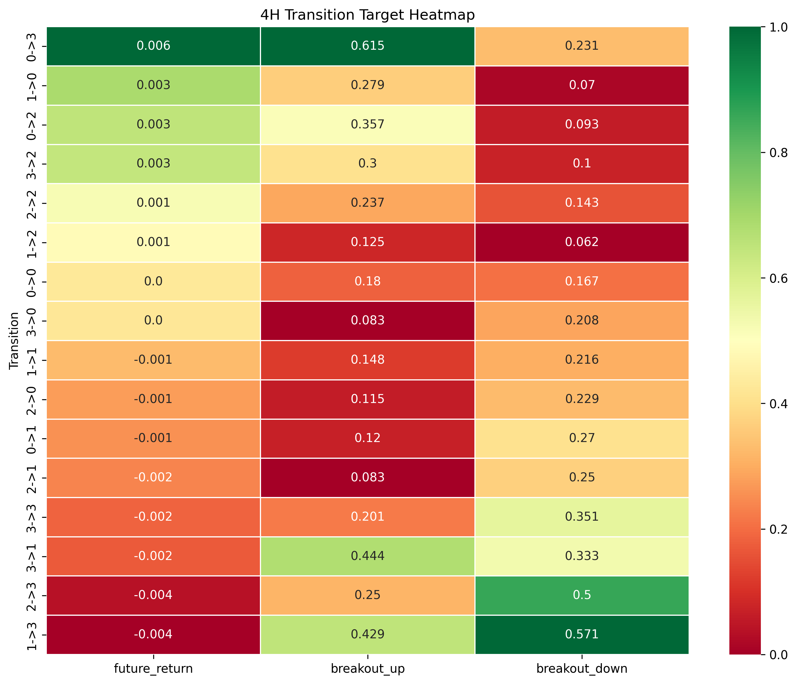

## 1. Overview

Financial markets are often described as chaotic and unpredictable systems. However, recurring market structures may emerge when behavior is analyzed through data.

This project investigates whether financial markets can be represented as a sequence of observable regimes rather than a purely random process. Using clustering techniques and Markov chains, the study identifies market states, characterizes their behavior, and analyzes how transitions between regimes influence future market outcomes.

The analysis is performed on XAUUSD (Gold Spot) data and focuses on regime persistence, transition dynamics, and directional market behavior.

---

## 2. Research motivation

One of the central challenges in financial markets is distinguishing between randomness and structure.

If markets are completely random, identifying persistent patterns or recurring behaviors should be impossible. However, if distinct market states exist, it may be possible to characterize their behavior and study how they evolve over time.

Understanding this distinction is important because it affects how uncertainty, decision-making, and market behavior are interpreted.

---
## 3. Research Question

The project seeks to answer the following questions:

- Can financial markets be segmented into distinct regimes?
- Do these regimes exhibit different behavioral characteristics?
- Are some regimes more persistent than others?
- How likely is the market to transition from one regime to another?
- Can transition dynamics provide useful information beyond regime identification itself?

---

## 4. Dataset

The analysis is based on historical XAUUSD (Gold Spot) market data.
The dataset includes OHLCV information and derived market features used to characterize market behavior across multiple time horizons.

---

## 5. Methodology

Market Data
      ↓
Feature Engineering
      ↓
Clustering
      ↓
Regime Characterization
      ↓
Target Analysis
      ↓
Markov Transition Modeling
      ↓
Transition-Based Target Analysis
      ↓
Validation & Out-of-Sample Evaluation

---
## 6. Main Contributions

This project contributes by:

- Identifying market regimes using unsupervised learning.
- Characterizing each regime through volatility, efficiency, persistence, and order-flow features.
- Modeling regime evolution using Markov chains.
- Evaluating transition stability through persistence, duration, and entropy.
- Demonstrating that regime transitions contain more predictive information than isolated regimes.
- Validating transition behavior across validation and out-of-sample datasets.

---
## 7. Results
### Regime Identification: 

The results suggest that market behavior is not entirely random. Distinct regimes emerged consistently across the analysis, exhibiting different characteristics in terms of efficiency, volatility, persistence, compression, and market activity.

These findings indicate that market dynamics may be organized into observable states rather than representing a purely chaotic process.

The identification of such regimes provides a structured framework for studying market behavior and evaluating how uncertainty evolves through time.

### Cluster Characterization

Once the regimes were identified, each cluster was analyzed using its average feature profile. The results showed that every regime exhibits a unique behavioral signature, characterized by different levels of efficiency, persistence, volatility, compression, market activity, and order-flow imbalance.

This step transforms clustering from a purely statistical exercise into an interpretable framework for describing market conditions.

### Target Differentiation Across Regimes

To determine whether the identified regimes contain predictive information, several forward-looking targets were evaluated:

- Future Return
- Breakout Up
- Breakout Down
- Sharpe-like Ratio

Future return was considered the primary target; however, the results showed limited differentiation across clusters. In contrast, breakout-related targets displayed clearer differences, suggesting that the clustering process captures variations in directional pressure and market structure rather than direct return predictability.

### Regimen stability 
Since future returns alone did not strongly distinguish the regimes, the analysis shifted toward studying their temporal behavior.

For each regime, persistence, expected duration, and transition entropy were estimated. The results revealed substantial differences in stability, with some regimes remaining active for extended periods while others transitioned more frequently.

This finding suggests that the value of clustering lies not only in identifying market states but also in understanding how long those states tend to persist.

### Markov Transition Modeling

A Markov framework was then used to model regime evolution through time.

Transition matrices were estimated to quantify:

Regime persistence
Expected duration
Transition probabilities
Transition uncertainty (entropy)

The analysis revealed dominant transition pathways and identified stable regimes that act as recurring states within the market structure.

### Transition-Based Target Analysis

After evaluating the target behavior within each cluster, it was observed that future returns alone did not provide a strong separation between market regimes. While some differences existed, the clustering process was not able to identify regimes with consistently distinct return profiles.

To further investigate the information contained in the market states, the analysis was extended from individual clusters to regime transitions. Using the Markov framework, each observation was classified according to the transition between consecutive states (e.g., 0→3, 1→0, 2→3).

The resulting heatmap summarizes the average target behavior associated with each transition. Three target variables were analyzed:

* **Future Return:** average forward return after the transition.
* **Breakout Up:** probability of an upward breakout.
* **Breakout Down:** probability of a downward breakout.

### Validation vs Out-of-Sample Transition Analysis
To evaluate the robustness of the transition-based framework, the average future returns associated with the most relevant regime transitions were compared between the validation and out-of-sample datasets.

The results show that several transitions maintain positive returns across both samples, suggesting that part of the information extracted from the regime transition process generalizes beyond the calibration period.

Among the strongest transitions, **3→2** stands out as the most consistent pattern, exhibiting the highest average future return in both validation and out-of-sample data. Similarly, transitions **3→0**, **1→1**, and **0→1** maintain positive returns across both datasets, indicating a degree of stability in their directional behavior.

Interestingly, some transitions that exhibited weak or even negative returns during validation, such as **2→3** and **2→2**, showed substantially improved performance out-of-sample. This suggests that the predictive information contained within regime evolution may vary across market environments and reinforces the importance of evaluating transition dynamics under different market conditions.

A key observation is that transitions involving Clusters **2** and **3** repeatedly appear among the strongest performers in the out-of-sample dataset. This finding is consistent with the previous transition heatmap analysis, where these states exhibited distinctive breakout characteristics and directional behavior.

Overall, the results indicate that the predictive value is not concentrated in a single cluster but rather emerges from the interaction between regimes and their transition dynamics. Consequently, the analysis supports the use of a Markov-based framework to model market evolution and motivates the next stage of the research, where transition probabilities, persistence, and order flow characteristics will be combined to better understand the mechanisms driving future market movements.

### Research implications
The findings suggest that market behavior is better explained by regime evolution than by static regime identification alone.

While clustering provides a useful representation of market states, the transition dynamics between those states contain additional information regarding future market behavior. Consequently, the final stage of the research focuses on combining regime transitions with order-flow and market microstructure analysis to better understand the mechanisms driving directional market movements.

---
## 8. Key findings

- Market regimes can be identified consistently across multiple timeframes.
- Regimes exhibit distinct structural characteristics.
- Future returns show limited separation at the cluster level.
- Regime stability differs substantially across states.
- Markov transitions reveal dominant market pathways.
- Transition dynamics contain more predictive information than isolated regimes.
- Several transition patterns remain robust out-of-sample.
---
## 9.Limitations
Several limitations should be considered:

- The analysis focuses exclusively on XAUUSD.
- Market regimes are sensitive to the selected feature set.
- Transition dynamics may change across market environments.
- Future returns showed limited separation at the cluster level.
- Results should be interpreted as exploratory rather than predictive.
---
## 10. Future Work

Future developments of the framework include:

- Regime-based risk characterization
- Multi-timeframe regime integration
- Market microstructure analysis using footprint data
- Decision tree models for regime classification
- Probabilistic forecasting and decision support systems
---
## 11. Conclusion
The study suggests that financial markets can be represented as a sequence of observable regimes rather than a purely random process.

While cluster-level analysis showed limited predictive power in future returns, regime transitions revealed meaningful differences in directional behavior and breakout probabilities.

The results indicate that market evolution, modeled through Markov transition dynamics, contains more information than static regime identification alone. This supports the use of transition-based frameworks for understanding and monitoring market behavior under uncertainty.

---
## 12. Repository structure
market_regime_project/

├── config/
├── data/
├── pipelines/
├── src/
│   ├── clustering/
│   ├── features/
│   ├── markov/
│   ├── targets/
│   └── visualization/
├── results/
└── README.md

---
## 13. Reproducibility
The complete workflow can be reproduced by executing the pipeline scripts sequentially:

01_feature_engineering.py
02_clustering.py
03_cluster_analysis.py
04_transition_matrix.py
05_transition_statistics.py
06_validation.py
11_visualization.py

